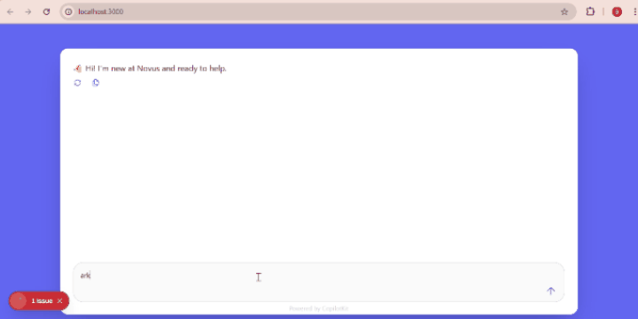

# AG-UI Powered Smart Assistant Demo — Agno × CopilotKit

**Powered by the ag-ui protocol.** Interact with agents and see live, streaming updates directly in the interface. This modern Next.js experience unifies meeting assistance, web/news research, email, customer support flows, and multi-step planning in one place. Results are presented in clean **Markdown** with **tables** where helpful, so you can scan and act fast.

## Demo


## Key Capabilities

- **Live Theme & Personalization**  
  Customize the interface colors to your taste—changes apply **instantly**.
  ## Demo (Video)

<video src="docs/demo-renk.mp4" controls width="720">
  Your browser does not support the video tag.
</video>

- **Multi-Step Task Planner**  
  For complex requests, generates a crisp **10-step action plan** and follows up with a short, creative “how we’ll proceed” summary.

  <video src="docs/demo-task.mp4" controls width="720">
  Your browser does not support the video tag.
  </video>

- **Meeting Assistant**  
  Automatically understands topic, date, and time from your message and presents a sleek confirmation card in the UI.

- **Sourced Web News**  
  Searches the web, extracts the most relevant results, and includes the **original source link** for each item.

- **Gmail Integration**  
  With Gmail authentication, you can view your inbox/outbox. Provide a recipient and a short description—the assistant drafts a polished subject and body, then **sends the email** for you.

- **Academic Research (arXiv)**  
  Surfaces the **top 3 or 5** relevant papers with **official arXiv links** and a one-line takeaway for each.


## Notes
- Outputs are always **readable**, **concise**, and **action-oriented**.
- For security, keep API keys and tokens out of the repo. Use environment variables (e.g., `.env` or your hosting provider’s **Environment Variables**) and ignore sensitive files like `agent/token.json`.
- Thanks to the **ag-ui protocol**, you can interact with agents and see **live updates** directly in the interface.


## Prerequisites

- Node.js 18+ 
- Python 3.8+
- OpenAI API Key (for the Agno agent)
- Any of the following package managers:
  - pnpm (recommended)
  - npm
  - yarn
  - bun

> **Note:** This repository ignores lock files (package-lock.json, yarn.lock, pnpm-lock.yaml, bun.lockb) to avoid conflicts between different package managers. Each developer should generate their own lock file using their preferred package manager. After that, make sure to delete it from the .gitignore.

## Getting Started

1. Install dependencies using your preferred package manager:
```bash
# Using pnpm (recommended)
pnpm install

# Using npm
npm install

# Using yarn
yarn install

# Using bun
bun install
```

> **Note:** Installing the package dependencies will also install the agent's python dependencies via the `install:agent` script.

2. Set up your OpenAI API key:
```bash
export OPENAI_API_KEY="your-openai-api-key-here"
```

or create a `.env` file.

```bash
echo "OPENAI_API_KEY=your-openai-api-key-here" > agent/.env
```

3. Start the development server:
```bash
# Using pnpm
pnpm dev

# Using npm
npm run dev

# Using yarn
yarn dev

# Using bun
bun run dev
```

This will start both the UI and agent servers concurrently.

## Available Scripts
The following scripts can also be run using your preferred package manager:
- `dev` - Starts both UI and agent servers in development mode
- `dev:debug` - Starts development servers with debug logging enabled
- `dev:ui` - Starts only the Next.js UI server
- `dev:agent` - Starts only the Agno agent server
- `build` - Builds the Next.js application for production
- `start` - Starts the production server
- `lint` - Runs ESLint for code linting
- `install:agent` - Installs Python dependencies for the agent

## Documentation

The main UI component is in `src/app/page.tsx`. You can:
- Modify the theme colors and styling
- Add new frontend actions
- Customize the CopilotKit sidebar appearance

## 📚 Documentation

- [Agno Documentation](https://docs.agno.com/introduction) - Learn more about Agno and its features
- [CopilotKit Documentation](https://docs.copilotkit.ai) - Explore CopilotKit's capabilities
- [Next.js Documentation](https://nextjs.org/docs) - Learn about Next.js features and API
- [YFinance Documentation](https://pypi.org/project/yfinance/) - Financial data tools
